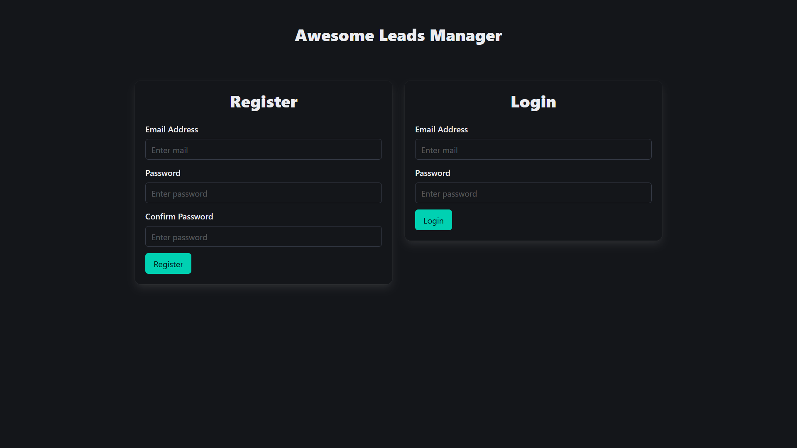
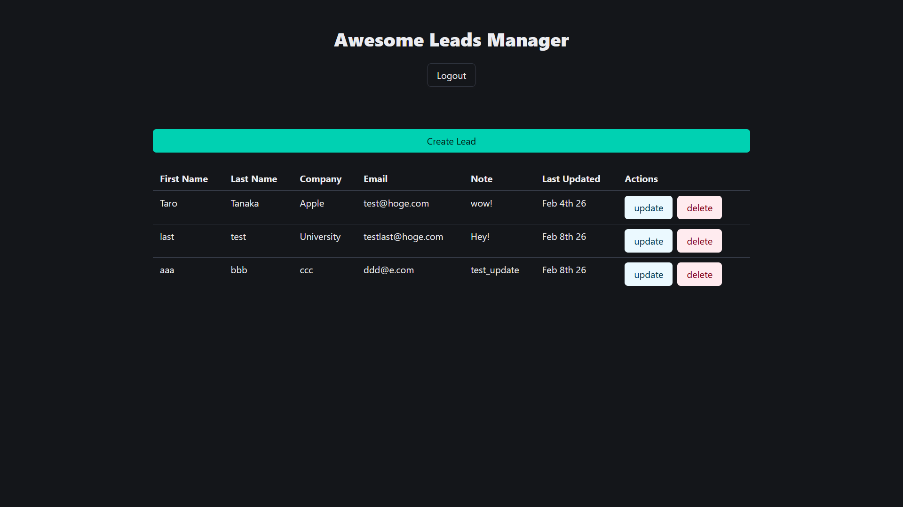

# Awesome Lead Manager (Learning Project)

## 1. プロジェクト概要

### コンセプト
　本プロジェクトは、FastAPI（バックエンド）とReact（フロントエンド）を組み合わせたフルスタックWeb開発の手法を習得するための学習用リポジトリです。「見込み顧客（リード）管理」を題材に、モダンなシングルページアプリケーション（SPA）の基本構造を再現しました。

### スクリーンショット
| 認証画面 | メインダッシュボード |
| :---: | :---: |
|  |  |

### プロジェクトのスタンス
　本アプリは、技術教材の内容をベースに開発されました。2026年現在の最新ライブラリ環境と教材公開時の仕様差によるエラーを自力でトラブルシューティングしながら、「**動作原理の深い理解**」と「**問題解決プロセスの習得**」に重点を置いて取り組みました。  
　今後は本プロジェクトで得た知見を活かし、オリジナルのWebアプリを作成する予定です。

---

## 2. 実装された機能と学習内容

### 主要機能
- **ユーザー認証**: JWT (JSON Web Token) を利用したログイン・サインアップ機能。
- **リード管理 (CRUD)**: ユーザーごとに隔離された顧客データの作成、一覧表示、詳細編集、削除。
- **データ保護**: Bcryptによるパスワードハッシュ化および環境変数による秘密鍵の管理。
- **自動ドキュメント生成**: FastAPIによるSwagger UI (OpenAPI) の自動生成と動作確認。

### 技術スタック
| カテゴリ | 使用技術 |
| :--- | :--- |
| **Backend** | Python 3.12.3, FastAPI, SQLAlchemy, Pydantic, Passlib |
| **Frontend** | Node.js v20.20.0, React, Axios, Bulma, Moment |
| **Infrastructure** | Windows 11 (WSL2 / Ubuntu 24.04), Uvicorn |

---

## 3. 開発におけるトラブルシューティング

　教材の写経にとどまらず、開発過程で発生した技術的課題に対し、以下の通り自力で原因特定と対策を行いました。

### Case 1: ライブラリのバージョン競合と仕様変更
- **事象**: `Passlib` と最新の `Bcrypt` 間の互換性エラーにより、パスワードハッシュ化が失敗。
- **原因**: `Bcrypt` のアップデートによる内部属性の削除に対し、ライブラリ側が未対応であったため。
- **対策**: `bcrypt==3.2.0` へのダウングレード固定を行い、安定稼働を優先。

### Case 2: APIレスポンスとプロキシの接続断 (HPE_CLOSED_CONNECTION)
- **事象**: 削除機能実行時に、DB上では成功しているにも関わらず、フロントエンドで接続エラーが発生。
- **原因**: FastAPIが返す `204 No Content` をプロキシが正しく処理できず、異常な切断として扱われた。
- **対策**: ステータスコードを `200` に変更し、明示的なJSONメッセージを返すことでフロントエンドとの通信を安定化。

### Case 3: 非同期コルーチンの実行制御
- **事象**: API実行時に `RuntimeWarning: coroutine was never awaited` が発生。
- **原因**: `async def` で定義された非同期関数の呼び出し時に `await` キーワードを失念。
- **対策**: ログのスタックトレースから呼び出し箇所を特定し、非同期処理のライフサイクルを適切に修正。

---

## 4. ディレクトリ構成

```text
web-app/
├── backend/                # FastAPI / SQLAlchemy
│   ├── main.py             # エントリポイント
│   ├── database.py         # DB接続・セッション管理
│   ├── models.py           # DBテーブル定義 (SQLAlchemy Models)
│   ├── services.py         # ビジネスロジック・認証処理
│   ├── schemas.py          # データバリデーション (Pydantic)
│   ├── .env.example        # 環境変数テンプレート
│   └── requirements.txt    # 依存ライブラリ一覧
└── frontend/               # React / Node.js
    ├── src/
    │   ├── components/     # UIコンポーネント
    │   └── App.js          # メインロジック
    └── package.json
```

## 5. セットアップと実行方法

　本プロジェクトをローカル環境で再現するための手順です。

### 1. バックエンドの起動
ターミナルを開き、バックエンドのディレクトリに移動して仮想環境の構築とサーバーの起動を行います。

```bash
cd backend

# 仮想環境の構築と有効化
python3 -m venv venv
source venv/bin/activate

# 依存関係のインストール
pip install -r requirements.txt

# 環境変数の設定
cp .env.example .env
# ※ .env内の JWT_SECRET を任意の値（推測されにくい文字列）に書き換えてください

# サーバーの起動
uvicorn main:app --reload
```

### 2. フロントエンドの起動
別のターミナルを開き、フロントエンドの依存パッケージをインストールして開発サーバーを起動します。

```bash
cd frontend

# NPMパッケージのインストール
npm install

# 開発サーバーの起動
npm start
```

## 6. プロジェクト情報

### 出典・参考教材
　本プロジェクトは、フルスタックWeb開発の基礎（FastAPI + React）を習得するため、以下の教材をベースに学習・開発を行いました。

- **教材名**: FastAPI + React チュートリアル (YouTube)
- **URL**: [https://youtube.com/playlist?list=PLhH3UpV2flrwfJ2aSwn8MkCKz9VzO-1P4](https://youtube.com/playlist?list=PLhH3UpV2flrwfJ2aSwn8MkCKz9VzO-1P4)

### 作者
- **中澤 幸大 (Kota Nakazawa)**
- **GitHub**: [https://github.com/Kota-James](https://github.com/Kota-James)

### ライセンス (License)
　本プロジェクトは **MIT License** に基づき公開されています。
本ソフトウェアは、教材元である **Francis Ali** 氏によるリポジトリのライセンス条項を継承しています。詳細は [LICENSE](./LICENSE) ファイルを参照してください。